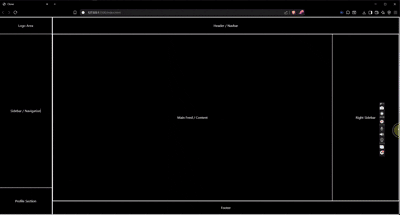

# Responsive Layout Skeleton

A responsive webpage layout skeleton built using HTML and Tailwind CSS to understand frontend structure,
flexbox layouts, and responsive design principles.

---

## Preview

---

## Purpose

This project was created to better understand:

- webpage layout hierarchy
- flexbox behavior
- responsive design
- sidebar/content structure
- section-based UI architecture

---

## Sections Included

- Sidebar
- Header / Navbar
- Main Content Area
- Right Sidebar
- Footer

---

## Tech Stack

- HTML5
- Tailwind CSS

---

## Learning Focus

Instead of focusing on styling first, this project focuses on understanding how real webpages are
structurally divided and made responsive across different screen sizes.
